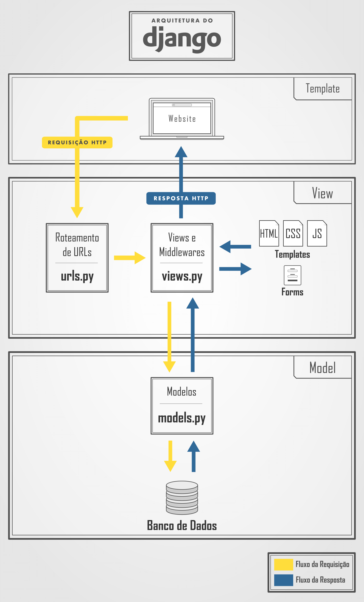

# Documento arquitetural

## Descrição

## Visão geral

O Django segue a arquitetura de software conhecida como Model-View-Template (Modelo-Visão-Template), comumente abreviada como MTV.

1. Model (Modelo):
   O modelo representa a camada de dados do aplicativo. Ele define a estrutura e
   o comportamento dos dados que serão armazenados no banco de dados. Os modelos
   Django incluem campos que representam os atributos dos objetos, métodos para
   manipulação dos dados e relacionamentos com outros modelos.

2. View:
   A view é responsável por processar as solicitações dos usuários e retornar
   uma resposta adequada. No Django, as views são funções ou classes que recebem
   uma solicitação HTTP e retornam uma resposta HTTP. As views podem acessar os
   dados do modelo, executar lógica de negócios e renderizar um template para
   enviar como resposta.

3. Template:
   O template é responsável por definir a aparência da interface do usuário. Ele
   contém a estrutura HTML com tags especiais do Django, que permitem a inclusão
   de dados dinâmicos e lógica de apresentação.

### Fluxo do MTV

> 
>
> [Fonte da imagem](https://pythonacademy.com.br/blog/desenvolvimento-web-com-python-e-django-introducao)

O fluxo básico do MTV no Django é o seguinte:

1. O Django recebe uma solicitação HTTP.
2. Com base na URL da solicitação, o Django chama a view correspondente.
3. A view processa a solicitação, interage com os modelos para obter ou salvar
   dados e renderiza um template com os dados relevantes.
4. O template é preenchido com os dados e enviado como resposta HTTP.
5. O navegador exibe a resposta recebida.

O Django facilita a separação de responsabilidades ao seguir esse padrão,
tornando o desenvolvimento web mais organizado e escalável. Cada componente -
modelo, visão e template - possui uma função específica, o que permite que os desenvolvedores trabalhem em paralelo em diferentes aspectos do aplicativo e
promove a reutilização de código.

## Requisitos não funcionais

## Mecanismos arquiteturais

### Tecnologias

## Decisões de design

## Validação de casos de teste

## Componentes

## Implantação

## Referências

[Desenvolvimento web com python e django: Introdução - Vinícius Ramos (PythonAcademy)](https://pythonacademy.com.br/blog/desenvolvimento-web-com-python-e-django-introducao)

[Entendendo o MTV do Django - Fagner Pinheiro (Treinaweb)](https://www.treinaweb.com.br/blog/entendendo-o-mtv-do-django)
