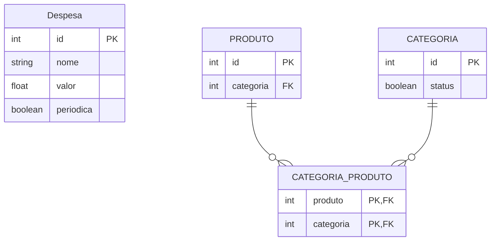

# Documento de modelos

## Modelo de dados

```mermaid
erDiagram
  Despesa {
    int id PK
    string nome
    float valor
    boolean periodica
  }

  PRODUTO {
    int id PK
    int categoria FK
  }

  CATEGORIA_PRODUTO {
    int produto PK, FK
    int categoria PK, FK
  }

  CATEGORIA {
    int id PK
    boolean status
  }

  PRODUTO ||--o{ CATEGORIA_PRODUTO : ""
  CATEGORIA ||--o{ CATEGORIA_PRODUTO : ""
```
