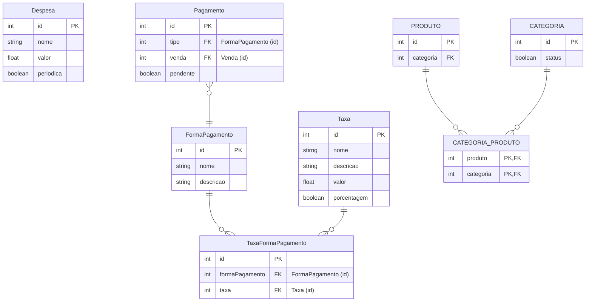

# Documento de modelos

## Modelo de dados

### Dicionário de dados

#### Tabela Despesa

A tabela despesa guarda informações à respeito das contas que a empresa deve
pagar.

| Atributo | Descrição | Tamanho | Restrições |
| -------- | --------- | ------- | ---------- |
| id       | Identificador unico da despesa | - | Gerado automaticamente pelo banco de dados |
| nome     | Descreve o nome da despesa | 150 | - |
| periodica | Define se aquela despesa se repete mensalmente | - | O valor default é `false` |
| valor    | Descreve o valor da despesa | - | Não deve aceitar valor menor ou igual a zero |
