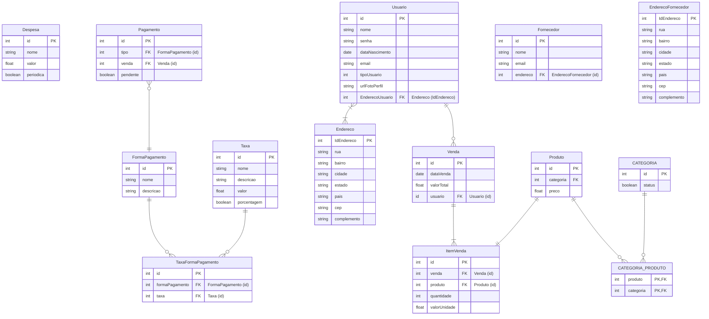

# Documento de modelos

## Modelo de dados

### Dicionário de dados

#### Tabela Despesa

A tabela despesa guarda informações à respeito das contas que a empresa deve
pagar.

| Atributo | Descrição | Tamanho | Restrições |
| -------- | --------- | ------- | ---------- |
| id       | Identificador unico da despesa | - | Gerado automaticamente pelo banco de dados |
| nome     | Descreve o nome da despesa | 150 | - |
| periodica | Define se aquela despesa se repete mensalmente | - | O valor default é `false` |
| valor    | Descreve o valor da despesa | - | Não deve aceitar valor menor ou igual a zero |

#### Tabela Pagamento

A tabela Pagamento guarda informações à respeito do pagamento de uma venda.

| Atributo | Descrição | Tamanho | Restrições de domínio |
| -------- | --------- | ------- | --------------------- |
| id       | Identificador unico do pagamento | - | Gerado automaticamente pelo banco de dados |
| pendente | Define se o pagamento já foi efetivado | - | O valor default é `true` |

#### Tabela FormaPagamento

A tabela FormaPagamento guarda informações à respeito das formas de pagamento
adotadas nas vendas.

| Atributo | Descrição | Tamanho | Restrições de domínio |
| -------- | --------- | ------- | --------------------- |
| id       | Identificador unico da forma de pagameto | - | Gerado automaticamente pelo banco de dados |
| descricao | Descreve em mais detalhes a forma de pagamento | 250 | Pode ser deixado em branco |

#### Tabela TaxaFormaPagamento

A tabela TaxaFormaPagamento guarda informações à respeito de cada taxa cobrada
em cada forma de pagamento.

| Atributo | Descrição | Tamanho | Restrições de domínio |
| -------- | --------- | ------- | --------------------- |
| id       | Identificador unico da taxa de forma de pagameto | - | Gerado automaticamente pelo banco de dados |

#### Tabela Taxa

A tabela Taxa guarda informações à respeito das taxas cobradas nas formas de
pagamento.

| Atributo | Descrição | Tamanho | Restrições de domínio |
| -------- | --------- | ------- | --------------------- |
| id       | Identificador unico da taxa | - | Gerado automaticamente pelo banco de dados |
| descricao | Descreve em mais detalhes a taxa | 250 | Pode ser deixado em branco |
| valor    | Descreve o valor da taxa | - | Não deve aceitar valor menor ou igual a zero |
| porcentagem | Define se o valor deve ser considerado como número absoluto ou porcentagem na hora de calcular a dedução de taxas | - | O valor default é `false` |
